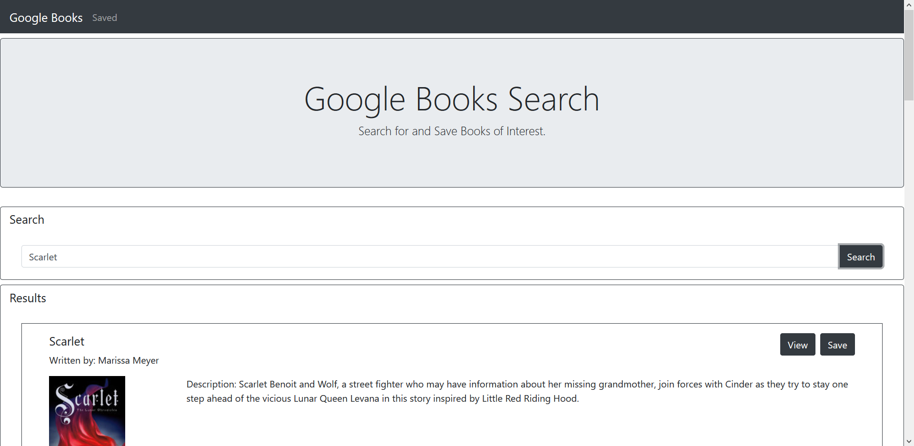
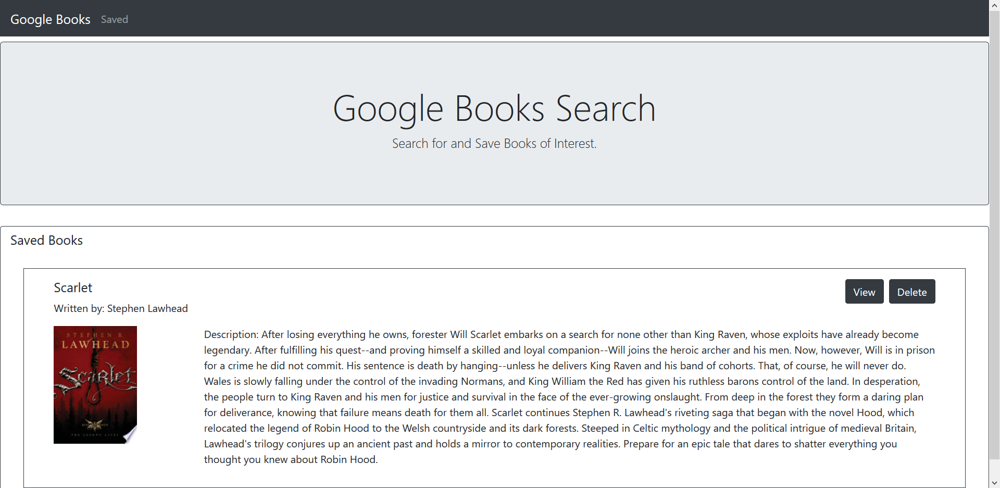

# google-books-search

[See the App here!](https://gbooksbc.herokuapp.com/)

This app is a MERN application that allows users to search for books using the Google Books API and save them for later viewing.

## Search Page

This is where the user can search for books, it will display the title, authors, description, and an image in the list. The user can click the View button to see the book on Google Books or click the Save button to save the book.

## Saved Page

This is where the user's saved books are shown. It functions similarly to the search page except the user can't search, but they can delete books from the list by clicking the Delete button.